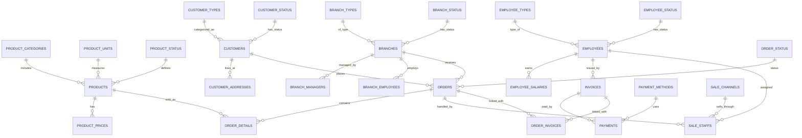

# 02. Database Design - Retail Database

## 1. Mục tiêu thiết kế

Cơ sở dữ liệu **Retail Database** được thiết kế nhằm mô phỏng hệ thống giao dịch thực tế của một chuỗi bán lẻ, với mục tiêu:

- Lưu trữ toàn bộ dữ liệu vận hành của doanh nghiệp: sản phẩm, khách hàng, nhân viên, đơn hàng, hóa đơn, thanh toán.
- Đảm bảo **tính toàn vẹn dữ liệu** và **tối ưu cho xử lý giao dịch (OLTP)**.
- Cho phép **mở rộng quy mô dữ liệu lớn** thông qua cơ chế **partitioning** và **tablespace**.
- Báo cáo nhẹ, với các truy vấn cơ bản và Materiallzed View.
- Dễ dàng mở rộng trong tương lai để tích hợp với Data Warehouse và hệ thống BI.

---

## 2. Triết lý thiết kế

- **Chuẩn hóa dữ liệu (3NF)**:  
  Giảm thiểu trùng lặp, tăng tính toàn vẹn và dễ bảo trì.
  
- **Phân tách module rõ ràng**:  
  CSDL được chia thành các nhóm chính: *Product*, *Customer*, *Employee*, *Branch*, *Order & Payment*.

- **Áp dụng ràng buộc toàn vẹn (constraint)**:  
  Sử dụng đầy đủ `PRIMARY KEY`, `FOREIGN KEY`, `CHECK`, và `NOT NULL`.

- **Tối ưu lưu trữ và hiệu năng**:  
  Dùng `PARTITION BY RANGE` và `SUBPARTITION BY HASH` cho các bảng lớn như `Orders`, `Order_Details`, `Invoices`, `Payments`, `Sale_Staffs`.

---

## 3. Cấu trúc logic tổng thể

CSDL bao gồm **5 phân hệ chính** và **28 bảng**:

| Nhóm | Các bảng tiêu biểu | Mục đích |
|------|--------------------|----------|
| 🛍️ **Sản phẩm (Products)** | `Product_Categories`, `Product_Units`, `Product_Status`, `Products`, `Product_Prices` | Quản lý danh mục, đơn vị tính, trạng thái và giá |
| 👥 **Khách hàng (Customers)** | `Customer_Types`, `Customer_Status`, `Customers`, `Customer_Addresses` | Quản lý thông tin khách hàng và địa chỉ |
| 🧑‍💼 **Nhân viên (Employees)** | `Employee_Types`, `Employee_Status`, `Employees`, `Employee_Salaries` | Quản lý hồ sơ, loại và lương nhân viên |
| 🏬 **Chi nhánh (Branches)** | `Branch_Types`, `Branch_Status`, `Branches`, `Branch_Managers`, `Branch_Employees` | Quản lý cửa hàng và nhân sự từng chi nhánh |
| 💳 **Giao dịch (Orders & Payments)** | `Order_Status`, `Invoice_Status`, `Orders`, `Order_Details`, `Invoices`, `Payments`, `Payment_Methods`, `Sale_Channels`, `Sale_Staffs`, `Order_Invoices` | Theo dõi toàn bộ quy trình đơn hàng đến thanh toán |

---

## 4. Mô hình ERD tổng quát


---

## 5. Partitioning Strategy

### 5.1. Mục tiêu
- Tối ưu hiệu năng truy vấn và quản lý dữ liệu lớn theo **thời gian**.
- Giảm chi phí bảo trì, backup, và phục hồi dữ liệu.
- Hỗ trợ khả năng **archiving** tự động theo chu kỳ.

### 5.2. Các bảng có phân vùng
| Bảng | Kiểu phân vùng | Cột phân vùng | Ghi chú |
|------|----------------|---------------|----------|
| `Orders` | RANGE + HASH Subpartition | `OrderDate`, `BranchID` | Tự động tạo mỗi 3 tháng |
| `Order_Details` | REFERENCE (kế thừa) | Theo `Orders` | Giữ đồng bộ dữ liệu đơn hàng |
| `Invoices` | RANGE | `InvoiceDate` | Tự động mỗi quý |
| `Payments` | RANGE | `PaymentDate` | Tự động mỗi quý |
| `Sale_Staffs` | RANGE + HASH Subpartition | `ShippedDate`, `ChannelID` | Cải thiện truy vấn theo kênh |

### 5.3. Lợi ích
- **Partition pruning**: chỉ quét dữ liệu trong khoảng thời gian cần thiết.
- **Parallel DML/Query**: tăng throughput với dữ liệu lớn.
- **Maintenance dễ dàng**: có thể truncate hoặc move partition mà không ảnh hưởng toàn hệ thống.

### 5.4. Ví dụ
```sql
CREATE TABLE Orders (
    OrderID NUMBER PRIMARY KEY,
    CustomerID NUMBER NOT NULL,
    BranchID NUMBER NOT NULL,
    OrderDate DATE DEFAULT CURRENT_DATE,
    StatusID NUMBER,
    TotalAmount NUMBER(10,2),
    ...
)
PARTITION BY RANGE (OrderDate)
INTERVAL (NUMTOYMINTERVAL(3, 'MONTH'))
SUBPARTITION BY HASH (BranchID)
SUBPARTITIONS 4
(
    PARTITION p_start VALUES LESS THAN (TO_DATE('2024-01-01','YYYY-MM-DD'))
)
TABLESPACE orders_ts;
```

---

## 6. Tablespace Design

### 6.1. Mục tiêu thiết kế
Việc tách dữ liệu thành nhiều **tablespace** giúp:
- Quản lý dung lượng và bảo trì dễ dàng hơn.
- Giảm I/O contention giữa các nhóm dữ liệu lớn.
- Tối ưu cho các hoạt động **backup**, **restore**, và **partition management**.

### 6.2. Phân bổ tablespace
| Tablespace | Chứa dữ liệu | Mục đích chính |
|-------------|---------------|----------------|
| `MASTER_TS` | Các bảng danh mục (Products, Employees, Customers, Branches, Status/Type), ... | Lưu dữ liệu chuẩn hoá, ít thay đổi |
| `ORDERS_TS` | `Orders`, `Order_Details`, `Order_Invoices`, `Sale_Staffs`, `Product_Prices` | Dữ liệu giao dịch chính theo thời gian |
| `INVOICES_TS` | `Invoices` | Lưu thông tin hóa đơn bán hàng |
| `PAYMENTS_TS` | `Payments` | Dữ liệu thanh toán, liên kết hoá đơn |
| `INDEX_TS` | Toàn bộ chỉ mục (indexes) | Giảm tải đọc ghi trên tablespace dữ liệu |
| `OPERATOR_TS` | Cho User operator | Lưu thông tin quyền của các user operator |
| `ANALYST_TS` | Cho User analyst | Lưu thông tin quyền của các user analyst |


---

### 6.3. Cấu hình ví dụ
```sql
CREATE TABLESPACE orders_ts 
  DATAFILE '/u02/oradata/ORCL/orclpdb/orders_ts01.dbf' 
  SIZE 200M AUTOEXTEND ON NEXT 10M MAXSIZE UNLIMITED;

CREATE TABLESPACE invoices_ts 
  DATAFILE '/u02/oradata/ORCL/orclpdb/invoices_ts01.dbf' 
  SIZE 200M AUTOEXTEND ON NEXT 10M MAXSIZE UNLIMITED;

CREATE TABLESPACE payments_ts 
  DATAFILE '/u02/oradata/ORCL/orclpdb/payments_ts01.dbf' 
  SIZE 200M AUTOEXTEND ON NEXT 10M MAXSIZE UNLIMITED;

CREATE TABLESPACE master_ts 
  DATAFILE '/u02/oradata/ORCL/orclpdb/master_ts01.dbf' 
  SIZE 100M AUTOEXTEND ON NEXT 50M MAXSIZE 2G EXTENT MANAGEMENT LOCAL
  SEGMENT SPACE MANAGEMENT AUTO;

CREATE TABLESPACE index_ts 
  DATAFILE '/u02/oradata/ORCL/orclpdb/index_ts01.dbf' SIZE 200M AUTOEXTEND ON NEXT 100M MAXSIZE 5G EXTENT MANAGEMENT LOCAL
  SEGMENT SPACE MANAGEMENT AUTO;
```

### 6.4. Nguyên tắc chung
- Các bảng dữ liệu lớn (Orders, Payments) luôn có partitioned tablespace riêng.
- Các danh mục chuẩn (Products, Customers, Employees) lưu tại MASTER_TS để tránh fragment dữ liệu.
- Indexes tách riêng để tối ưu caching và tốc độ quét.
- Tự động giám sát dung lượng bằng job định kỳ (DBA_TABLESPACE_USAGE_METRICS).

---

## 7. Index & Constraint Strategy

### 7.1. Mục tiêu
Thiết lập hệ thống chỉ mục (index) và ràng buộc (constraint) giúp:
- Cải thiện hiệu năng truy vấn OLTP (SELECT/UPDATE/DELETE).
- Duy trì tính toàn vẹn dữ liệu xuyên suốt giữa các bảng quan hệ.
- Hỗ trợ tối ưu join và filter trong truy vấn thường xuyên.

### 7.2. Chiến lược chỉ mục (Indexing)
| Loại | Index | Ứng dụng |	Bảng liên quan | Mục đích |
|------|-------|----------|----------------|----------|
| Primary Key Index | Tự động khi tạo PK | Toàn bộ bảng chính | Xác định bản ghi duy nhất |
| Foreign Key Index | Thủ công tạo thêm | Orders, Order_Details, Payments, ... | Cải thiện JOIN/DELETE |
| Composite Index | (BranchID, OrderDate) | Orders | Tối ưu truy vấn lọc theo chi nhánh và ngày |
| Composite Index | (CustomerID, OrderDate) | Orders | Tối ưu truy vấn lọc theo chi khách hàng và ngày |

### 7.3. Chiến lược ràng buộc (Constraints)
| Loại | Mục đích | Ghi chú |
|------|----------|---------|
| PRIMARY KEY | Xác định bản ghi duy nhất | Tự động tạo chỉ mục |
| FOREIGN KEY | Duy trì toàn vẹn giữa bảng cha – con | ON DELETE CASCADE khi phù hợp |
| CHECK | Kiểm soát giá trị hợp lệ	Price > 0, Quantity > 0 |
| UNIQUE | Ngăn trùng lặp dữ liệu quan trọng | Email, số điện thoại |
| NOT NULL | Đảm bảo dữ liệu bắt buộc | Các khóa ngoại, tên, mã định danh |

### 7.4. Nguyên tắc quản lý Index/Constraint
- Tạo index trên các foreign key có tần suất join cao.
- Tránh index thừa trên cột có tần suất cập nhật lớn (Insert/Update nhiều).
- Kiểm tra hiệu năng định kỳ bằng DBA_INDEX_USAGE và DBMS_STATS.GATHER_INDEX_STATS.
- Tên constraint tuân theo quy ước:
  + pk_ cho primary key
  + fk_ cho foreign key
  + chk_ cho check constraint
  + uq_ cho unique