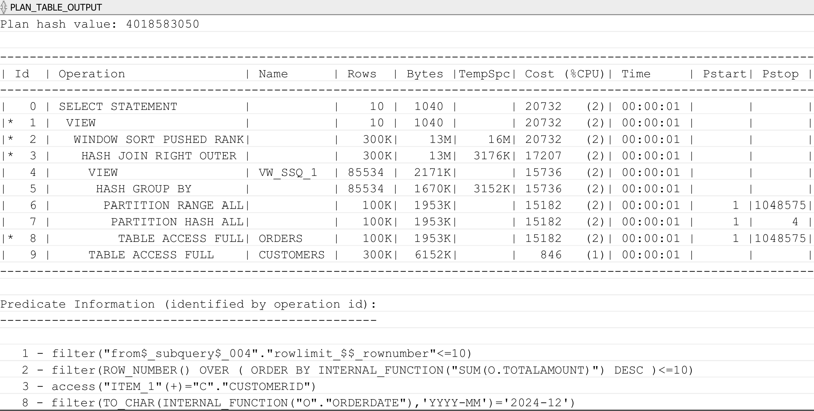
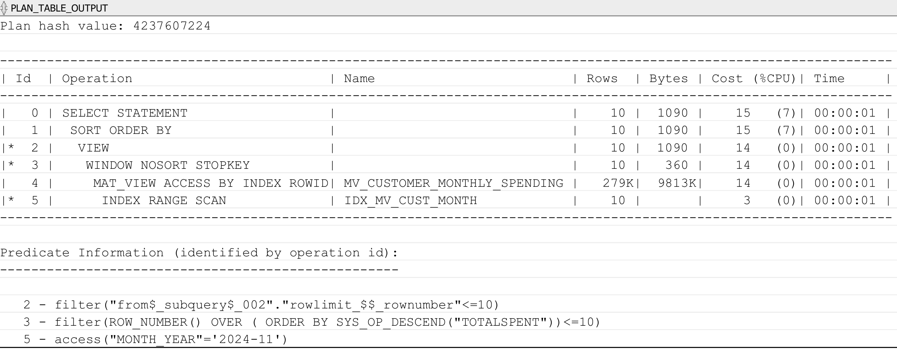
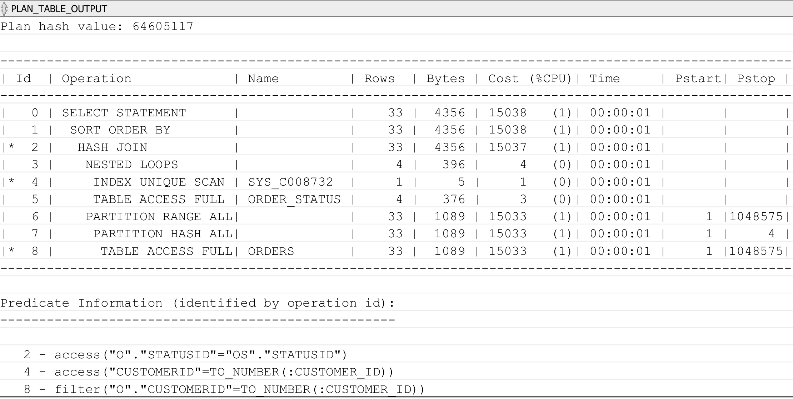
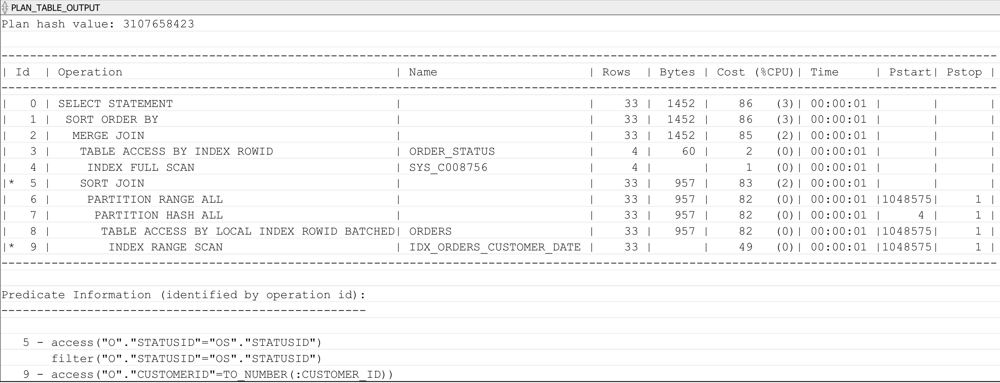
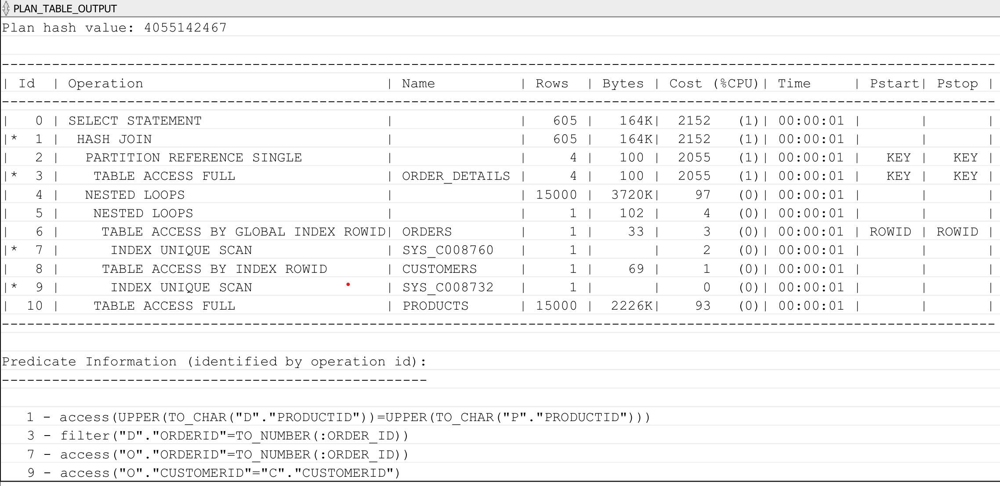
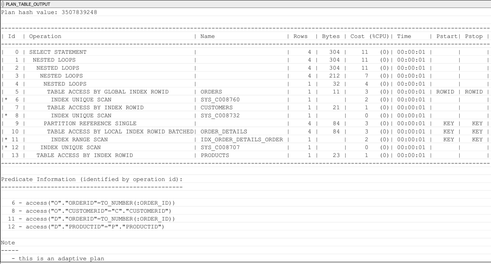
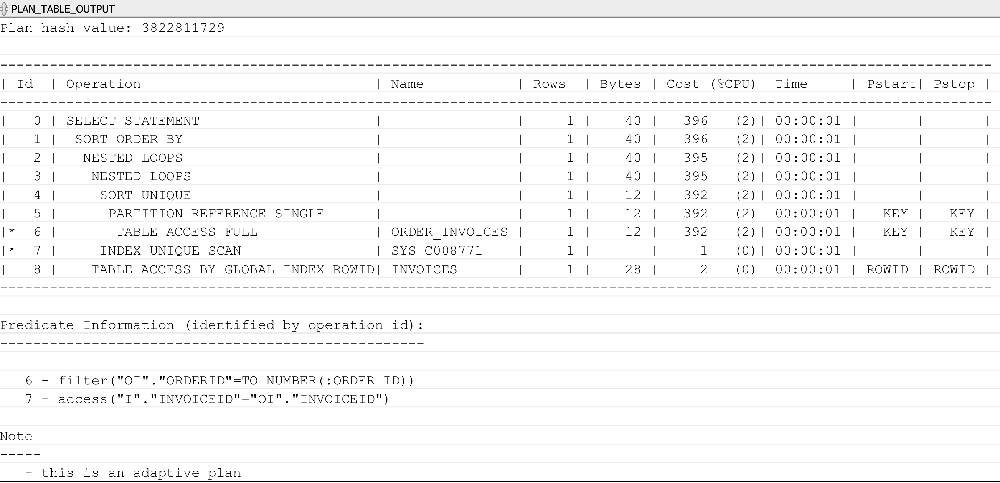
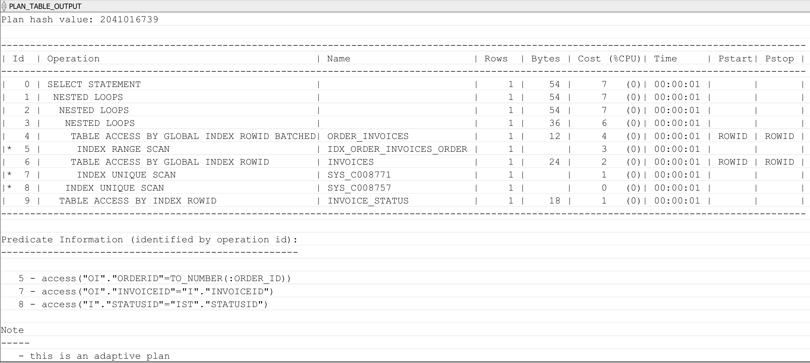
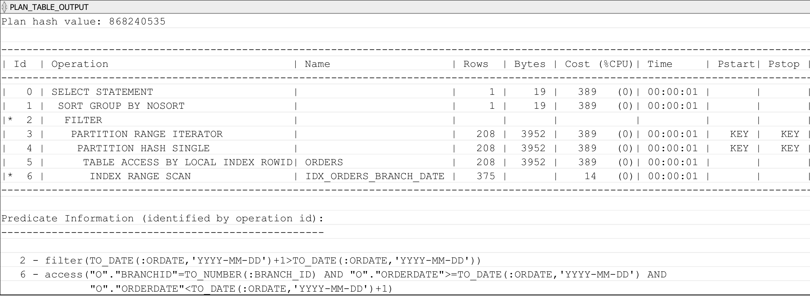

# 06. Tối ưu Hiệu năng Hệ thống RetailDB\

Tài liệu mô tả các kiểm tra, thay đổi và cải thiện hiệu năng cho cơ sở dữ liệu RetailDB. Bao gồm:
- Tổng quan nhu cầu tối ưu
- Before/After SQL tuning
- Các Index đã tạo
- Phân tích Execution Plan
- So sánh hiệu năng (dựa trên file Excel kết quả benchmark)
- Các khuyến nghị thêm cho hệ thống

## 1. Mục tiêu Tối ưu Hóa

Mục tiêu của quá trình tối ưu hiệu năng trong hệ thống Retail Database là đảm bảo rằng các truy vấn, quá trình load dữ liệu và hoạt động nghiệp vụ được thực thi nhanh chóng, ổn định và sử dụng tài nguyên hợp lý. Việc tối ưu hóa giúp hệ thống đáp ứng tốt nhu cầu phân tích – báo cáo, giảm thời gian phản hồi và nâng cao trải nghiệm người dùng.

Cụ thể, mục tiêu bao gồm:
- Giảm thời gian chạy truy vấn đối với các bảng lớn (Orders, Order_Items, Products, Customers…).
- Tối ưu kế hoạch thực thi (Execution Plan) bằng cách loại bỏ Full Table Scan không cần thiết.
- Tăng tốc độ tra cứu thông qua bổ sung hoặc tái thiết kế Index.
- Giảm IO và CPU usage, đặc biệt trong các truy vấn JOIN và Aggregate.
- Cải thiện tốc độ load dữ liệu (SQL*Loader, ETL csv → Oracle).
- Đảm bảo tính ổn định khi dữ liệu tăng trưởng theo thời gian.
- So sánh, đo đạc hiệu năng trước và sau tối ưu bằng công cụ:
    + EXPLAIN PLAN
    + DBMS_XPLAN.DISPLAY
    + Thời gian thực thi thực tế
    + File Excel tổng hợp số liệu
- Tài liệu hóa các thay đổi để đảm bảo có thể tái lập quy trình tối ưu về sau.

---

## 2. Vấn đề Hiện tại Trước Khi Tối ưu

Trước khi triển khai các kỹ thuật tối ưu hóa, hệ thống Retail Database gặp một số hạn chế làm giảm hiệu năng tổng thể. Các vấn đề chủ yếu ghi nhận được bao gồm:

### 2.1 Thời gian chạy truy vấn chậm
- Một số truy vấn báo cáo trên các bảng lớn (Orders, Order_Items, Products, ...) mất vài giây đến hàng chục giây.
- Các câu lệnh JOIN và GROUP BY thực thi chậm do thiếu chỉ mục phù hợp.

### 2.2 Full Table Scan xảy ra thường xuyên
- EXPLAIN PLAN cho thấy nhiều truy vấn thực hiện Full Table Scan (FTS) mặc dù lọc dữ liệu theo:
  + customer_id
  + order_date
  + product_id
- Việc này làm tăng IO và kéo dài thời gian phản hồi.

### 2.3 Thiếu Index hoặc Index không phù hợp
- Một số cột thường được dùng để tìm kiếm hoặc JOIN nhưng chưa có index.
- Một số index hiện có không còn phù hợp với mô hình truy vấn thực tế (ví dụ: index đơn lẻ thay vì composite).

### 2.4 Cost Execution Plan cao
Các kế hoạch thực thi có:
- Cost lớn
- Cardinality sai lệch
- JOIN bằng HASH JOIN không tối ưu khi dữ liệu nhỏ
- Nested Loop hoạt động kém khi bảng lớn

### 2.5 Tài nguyên hệ thống chưa được sử dụng hiệu quả
- CPU tăng cao trong các truy vấn JOIN.
- IO disk tăng đột biến khi xuất báo cáo.
- Buffer Cache Hit Ratio thấp ở các thời điểm tải cao.

### 2.6 Chưa có tài liệu theo dõi hiệu năng
- Chưa có bảng so sánh thời gian thực thi trước/sau tối ưu.
- Chưa ghi nhận Execution Plan để đối chiếu.
- Chưa có số liệu tổng hợp dưới dạng bảng Excel.

---

## 3. Một Số Truy vấn Trước & Sau Khi Tối ưu

### 3.1. Khách hàng có tổng chi tiêu cao nhất
Before Optimization:
```sql
SELECT *
FROM (
    SELECT c.CustomerID, c.FullName,
           (SELECT SUM(o.TotalAmount)
            FROM Orders o
            WHERE o.CustomerID = c.CustomerID
              AND TO_CHAR(o.OrderDate, 'YYYY-MM') = '2024-12') AS TotalSpent
    FROM Customers c
)
ORDER BY TotalSpent DESC
FETCH FIRST 10 ROWS ONLY;"
```
Vấn đề:
- Subquery trong SELECT, Dùng TO_CHAR() trên cột OrderDate.
- Không có index phù hợp.

After Optimization:
```sql
SELECT *
FROM MV_CUSTOMER_MONTHLY_SPENDING
WHERE Month_Year = '2024-11'
ORDER BY TotalSpent DESC
FETCH FIRST 10 ROWS ONLY;
```
Tối ưu:
- Tạo Materiallzed View riêng cho báo cáo.
- Tạo Index cột thời gian cho Materiallzed View.

### 3.2. Xem đơn hàng của khách hàng
Before Optimization:
```sql
SELECT *
FROM Orders o, Order_Status os
WHERE o.StatusID = os.StatusID
  AND o.CustomerID IN (SELECT CustomerID FROM Customers WHERE CustomerID = :customer_id)
ORDER BY TO_CHAR(o.OrderDate, 'YYYY-MM-DD') DESC;
```
Vấn đề:
- Dùng cú pháp JOIN kiểu cũ.
- Subquery IN dư thừa.
- ORDER BY TO_CHAR phá index, chậm nhất.
- SELECT *, gây tốn băng thông.

After Optimization:
```sql
SELECT 
    o.OrderID,
    o.OrderDate,
    os.StatusName,
    o.TotalAmount
FROM Orders o
JOIN Order_Status os ON o.StatusID = os.StatusID
WHERE o.CustomerID = :customer_id
ORDER BY o.OrderDate DESC;
```
Tối ưu:
- Đổi từ cú pháp join cũ sang JOIN.
- Bỏ IN (SELECT …), thay bằng o.CustomerID = :customer_id.
- Bỏ TO_CHAR() trong ORDER BY.
- Chỉ SELECT các cột cần thiết.

### 3.3. Xem chi tiết đơn hàng
Before Optimization:
```sql
SELECT *
FROM Orders o
JOIN Order_Details d ON o.OrderID = d.OrderID
JOIN Products p ON UPPER(d.ProductID) = UPPER(p.ProductID)
JOIN Customers c ON o.CustomerID = c.CustomerID
WHERE o.OrderID IN (SELECT OrderID FROM Orders WHERE OrderID = :order_id);
```
Vấn đề:
- Subquery IN thừa.
- UPPER() ở join gây mất index -> full scan.
- SELECT *, gây tốn băng thông.
- Không có index phù hợp.

After Optimization:
```sql
SELECT
    o.OrderID,
    c.FullName,
    p.ProductName,
    d.Quantity,
    d.UnitPrice,
    (d.Quantity * d.UnitPrice) AS Subtotal
FROM Orders o
JOIN Order_Details d ON o.OrderID = d.OrderID
JOIN Products p ON d.ProductID = p.ProductID
JOIN Customers c ON o.CustomerID = c.CustomerID
WHERE o.OrderID = :order_id;
```
Tối ưu:
- Thêm index.
- Không còn subquery dư thừa.
- Không còn UPPER() phá index.
- SELECT đúng cột cần thiết.
- Join keys đúng chuẩn.
- Điều kiện lọc chính xác.

### 3.4. Hóa đơn của một đơn hàng
Before Optimization:
```sql
SELECT *
FROM Invoices i
WHERE i.InvoiceID IN (
    SELECT oi.InvoiceID
    FROM Order_Invoices oi
    WHERE oi.OrderID = :order_id
)
ORDER BY TO_CHAR(i.InvoiceDate, 'YYYY-MM-DD');
```
Vấn đề:
- TO_CHAR phá index, khiến Oracle phải sort thủ công.
- Subquery IN không tối ưu, dễ tạo FILTER/HASH SEMI JOIN.
- SELECT *, tốn băng thông.
- Thiếu index phù hợp.

After Optimization:
```sql
SELECT i.InvoiceID, i.InvoiceDate, i.TotalAmount, ist.StatusName
FROM Order_Invoices oi
JOIN Invoices i ON oi.InvoiceID = i.InvoiceID
JOIN Invoice_Status ist ON i.StatusID = ist.StatusID
WHERE oi.OrderID = :order_id;
```
Tối ưu:
- Bỏ IN (subquery).
- Bỏ TO_CHAR() trong ORDER BY.
- Chỉ lấy các cột cần dùng.
- Join theo khóa chuẩn.

### 3.5. Xem doanh số trong ngày của chi nhánh
Before Optimization:
```sql
SELECT *
FROM Orders
WHERE BranchID = :branch_id
  AND TO_CHAR(OrderDate, 'YYYY-MM-DD') = :Ordate;
```
Vấn đề:
- Bỏ TO_CHAR() trong WHERE.
- So sánh DATE với string.

After Optimization:
```sql
SELECT 
    o.BranchID, 
    SUM(o.TotalAmount) AS TotalSales
FROM Orders o
WHERE o.BranchID = :branch_id
  AND o.OrderDate >= TO_DATE(:Ordate, 'YYYY-MM-DD')
  AND o.OrderDate <  TO_DATE(:Ordate, 'YYYY-MM-DD') + 1
GROUP BY o.BranchID;
```
Tối ưu:
- Bỏ TO_CHAR(OrderDate).
- Dùng range filter (>= … AND < … + 1).
- Chỉ SELECT và GROUP BY đúng cột cần thiết.
- SUM() trên TotalAmount chính xác và nhẹ.

---

## 4. Execution Plan – So sánh Before/After

### 4.1. Khách hàng có tổng chi tiêu cao nhất
Before Optimization:


Đánh giá: (times: 0.014s)
- Quét Toàn bộ Bảng (TABLE ACCESS FULL): Hệ thống phải quét hết cả bảng lớn ORDERS (100K hàng) và CUSTOMERS (300K hàng) do thiếu index hoặc index không hiệu quả.
- Sắp xếp Tốn kém (WINDOW SORT PUSHED RANK): Chi phí cao nhất (20732) nằm ở bước sắp xếp 300K hàng để tính toán Top N khách hàng chi tiêu cao nhất.
- Lọc Ngày tháng kém hiệu quả: Việc sử dụng hàm (TO_CHAR) trên cột ORDERDATE trong Predicate 8 đã vô hiệu hóa việc sử dụng index trên cột ngày tháng, buộc phải quét toàn bộ bảng ORDERS.

After Optimization:


Đánh giá: (times: 0.002s)
- Loại bỏ Quét Bảng: Hệ thống đã thay thế việc quét toàn bộ các bảng lớn (ORDERS, CUSTOMERS) bằng cách truy cập dữ liệu đã được tổng hợp sẵn trong Materialized View (MV_CUSTOMER_MONTHLY_SPENDING).
- Tối ưu Sắp xếp Top N (WINDOW NOSORT STOPKEY): Chi phí bước sắp xếp giảm mạnh từ 20,732 xuống 14 nhờ cơ chế NOSORT (không cần sắp xếp) và STOPKEY (dừng ngay khi tìm đủ Top 10).
- Lọc Hiệu quả: Việc lọc ngày tháng được thực hiện nhanh chóng thông qua Index (INDEX RANGE SCAN) trên cột MONTH_YEAR='2024-11', hoàn toàn tránh được lỗi dùng hàm trên cột ngày tháng gốc.

### 4.2. Xem đơn hàng của khách hàng
Before Optimization:


Đánh giá: (times: 0.204s)
- Quét Toàn bộ Bảng (TABLE ACCESS FULL): Operation 8 thực hiện quét toàn bộ bảng ORDERS (33 hàng), lặp lại ở Operation 5 trên bảng ORDER_STATUS. Mặc dù số hàng (33) có vẻ nhỏ, việc quét toàn bộ bảng ORDERS là không hiệu quả nếu bảng này lớn hơn trong thực tế.
- Lọc Kém Hiệu quả (Predicate 8): filter("O"."CUSTOMERID"=TO_NUMBER(:CUSTOMER_ID)). Việc sử dụng hàm TO_NUMBER trên biến tham số chỉ được tối ưu hơn so với dùng hàm trên cột, nhưng vẫn có nguy cơ nếu CUSTOMERID không được index hoặc dữ liệu bị ép kiểu không tối ưu.
- Partitioning (Operation 6, 7): Sự hiện diện của PARTITION RANGE ALL và PARTITION HASH ALL ngụ ý rằng bảng ORDERS được phân vùng (partitioned). Tuy nhiên, vì truy vấn vẫn thực hiện TABLE ACCESS FULL trên tất cả các phân vùng, việc phân vùng không mang lại lợi ích lọc cho truy vấn này.
- HASH JOIN (Operation 2): Phép nối Hash được sử dụng, thường hiệu quả hơn NESTED LOOPS cho các tập dữ liệu lớn hơn, nhưng trong trường hợp này, NESTED LOOPS lại được sử dụng ở Operation 3, tạo ra một sự kết hợp phức tạp.

After Optimization:


Đánh giá: (times: 0.065s)
- Giảm Chi phí Khổng lồ: Chi phí đã giảm từ 15038 xuống chỉ còn 7. Đây là một sự cải thiện hiệu suất rất lớn.
- Sử dụng NESTED LOOPS Hiệu quả: Toàn bộ truy vấn được thực hiện bằng cách sử dụng các vòng lặp lồng nhau (NESTED LOOPS), đây là kỹ thuật rất hiệu quả khi dùng Index để truy cập dữ liệu.
- Truy cập bằng Index:
  + Operation 5 sử dụng INDEX RANGE SCAN trên IDX_ORDER_INVOICES_ORDER để tìm hóa đơn (hoặc thông tin hóa đơn) của đơn hàng (:ORDER_ID). Điều này cho thấy đã có Index phù hợp được tạo ra và sử dụng.
  + Operation 7 và 8 sử dụng INDEX UNIQUE SCAN và TABLE ACCESS BY INDEX ROWID trên bảng INVOICES và INVOICE_STATUS, đảm bảo việc tra cứu dữ liệu là nhanh nhất (tra cứu khóa duy nhất).
- Truy cập Từng Khối (BATCHED): Việc sử dụng TABLE ACCESS BY GLOBAL INDEX ROWID BATCHED (Operation 4) cho thấy hệ thống đang truy cập các hàng dựa trên ROWID lấy từ Index theo từng khối (batch), giúp tối ưu hóa I/O bằng cách đọc nhiều hàng cùng một lúc.

### 4.3. Xem chi tiết đơn hàng
Before Optimization:


Đánh giá: (times: 0.063s)
- Quét Toàn bộ Bảng Lớn (TABLE ACCESS FULL): Operation 10 thực hiện quét toàn bộ bảng PRODUCTS (15,000 hàng) với chi phí 93. Điều này là không cần thiết cho việc tra cứu chi tiết một đơn hàng. Tương tự, Operation 3 quét toàn bộ ORDER_DETAILS với chi phí 2055.
- HASH JOIN (Operation 1): Phép nối Hash ở cấp cao nhất có chi phí rất cao (2152), nó buộc phải xử lý một lượng lớn dữ liệu (605 hàng, 164K bytes), có thể là kết quả của việc quét toàn bộ bảng ở bước 3 và 10.
- Lọc/Nối Kém Hiệu quả (Predicate 1): access(UPPER(TO_CHAR("D"."PRODUCTID"))=UPPER(TO_CHAR("P"."PRODUCTID"))). Việc sử dụng các hàm (UPPER, TO_CHAR) trên cả hai cột PRODUCTID trong điều kiện nối là rất tốn kém và ngăn cản việc sử dụng Index, buộc hệ thống phải quét toàn bộ bảng PRODUCTS và ORDER_DETAILS.

After Optimization:


Đánh giá: (times: 0.02s)
- Giảm Chi phí Đột phá: Chi phí đã giảm từ 2152 xuống chỉ còn 11, cho thấy tốc độ truy vấn đã được cải thiện theo cấp số nhân.
- Sử dụng NESTED LOOPS: Toàn bộ truy vấn sử dụng NESTED LOOPS (Operation 1-4), đây là cơ chế nối lý tưởng khi truy cập một lượng nhỏ dữ liệu từ các bảng lớn bằng Index.
- Truy cập Bằng Index Tuyệt đối:
  + Truy cập các bảng ORDERS (Operation 5), CUSTOMERS (Operation 7) và PRODUCTS (Operation 13) đều được thực hiện thông qua TABLE ACCESS BY INDEX ROWID sau các bước INDEX UNIQUE SCAN (Operation 6, 8, 11, 12).
  + Quan trọng nhất, truy cập bảng ORDER_DETAILS (Operation 10) sử dụng INDEX RANGE SCAN (IDX_ORDER_DETAILS_ORDER), đảm bảo rằng việc tìm kiếm chi tiết đơn hàng chỉ dựa trên ORDERID cụ thể, tránh việc quét toàn bộ bảng ORDER_DETAILS và PRODUCTS.
- Lọc Hiệu quả: Các Predicate 6, 8, 11, 12 đều sử dụng so sánh trực tiếp hoặc hàm TO_NUMBER trên biến tham số, cho phép Index hoạt động. Việc loại bỏ các hàm UPPER/TO_CHAR ở Plan trước là yếu tố then chốt.

### 4.4. Hóa đơn của một đơn hàng
Before Optimization:


Đánh giá: (times: 0.088s)
- Quét Toàn bộ Bảng (TABLE ACCESS FULL): Operation 6 thực hiện quét toàn bộ bảng ORDER_INVOICES để tìm hóa đơn liên quan đến đơn hàng. Dù số hàng ước tính là 1, nhưng chi phí 392 cho thấy đây là thao tác tốn kém nhất, ngụ ý rằng truy vấn phải quét toàn bộ bảng vật lý (hoặc toàn bộ phân vùng) để tìm ra một bản ghi.
- Sử dụng SORT: Operation 1 và 4 sử dụng SORT ORDER BY và SORT tổng cộng 2 lần. Việc sắp xếp là không cần thiết cho một truy vấn tra cứu và làm tăng chi phí.
- Lọc Không Hiệu quả (Predicate 6): filter("OI"."ORDERID"=TO_NUMBER(:ORDER_ID)). Mặc dù dùng hàm trên biến tham số, nhưng việc không có Index phù hợp trên cột ORDER_INVOICES.ORDERID đã buộc hệ thống phải quét toàn bộ bảng (Operation 6).

After Optimization:


Đánh giá: (times: 0.019s)
- Giảm Chi phí Đột phá: Chi phí đã giảm từ 396 xuống chỉ còn 7, cho thấy tốc độ truy vấn đã được cải thiện đáng kể.
- Sử dụng NESTED LOOPS và Index: Toàn bộ truy vấn sử dụng NESTED LOOPS kết hợp với Index để truy cập dữ liệu. Đây là phương pháp tối ưu cho tra cứu đơn lẻ.
- Truy cập bằng Index:
  + Operation 5 sử dụng INDEX RANGE SCAN trên IDX_ORDER_INVOICES_ORDER. Đây là cải tiến quan trọng nhất, nó cho phép hệ thống tra cứu trực tiếp các bản ghi trong bảng ORDER_INVOICES dựa trên ORDERID, hoàn toàn loại bỏ thao tác quét toàn bộ bảng tốn kém (Operation 6 ở Plan trước).
  + Các bước truy cập bảng INVOICES và INVOICE_STATUS cũng được thực hiện hiệu quả bằng Index Unique Scan và TABLE ACCESS BY INDEX ROWID.
- Loại bỏ Sắp xếp: Không còn thao tác SORT nào (Operation 1, 4 ở Plan trước), giúp tiết kiệm tài nguyên.

### 4.5. Xem doanh số trong ngày của chi nhánh
Before Optimization:


Đánh giá: (times: 0.073s)
- Quét Toàn bộ Bảng (TABLE ACCESS FULL): Operation 3 thực hiện quét toàn bộ bảng ORDERS. Đây là nguyên nhân chính gây ra chi phí cao và làm chậm truy vấn.
- Lọc Ngày tháng Kém Hiệu quả (Predicate 3): TO_CHAR(INTERNAL_FUNCTION("ORDERDATE"),'YYYY-MM-DD')=:ORDATE. Việc sử dụng hàm (TO_CHAR) trên cột ORDERDATE trong mệnh đề WHERE đã vô hiệu hóa việc sử dụng bất kỳ Index nào trên cột này, buộc hệ thống phải quét toàn bộ bảng để đánh giá điều kiện lọc cho từng hàng.
- Partitioning Vô dụng: Mặc dù bảng được phân vùng (PARTITION RANGE ALL, PARTITION HASH SINGLE), việc thực hiện TABLE ACCESS FULL trên tất cả các phân vùng (RANGE ALL) cho thấy cơ chế lọc ngày tháng đã không thể tận dụng Partition Pruning (cắt tỉa phân vùng).

After Optimization:


Đánh giá: (times: 0.013s)
- Sử dụng Index: Operation 6 sử dụng INDEX RANGE SCAN trên IDX_ORDERS_BRANCH_DATE với chi phí chỉ 14. Index này rõ ràng được tạo ra trên cả BRANCHID và ORDERDATE, cho phép tra cứu nhanh chóng các đơn hàng của một chi nhánh trong phạm vi ngày cụ thể.
- Truy cập Index Từng Khối: Operation 5 sử dụng TABLE ACCESS BY LOCAL INDEX ROWID, cho thấy hệ thống sử dụng các ROWID lấy từ Index để truy cập bảng ORDERS một cách chọn lọc, hoàn toàn tránh được việc quét toàn bộ bảng.
- Tối ưu hóa Lọc Ngày tháng (Predicate 6): Điều kiện lọc đã được chuyển thành một phạm vi ngày sử dụng so sánh trực tiếp: ORDERDATE BETWEEN :ORDATE AND :ORDATE+1. Điều này tạo ra một Index Range Scan hiệu quả (sử dụng Index IDX_ORDERS_BRANCH_DATE) và cho phép cơ sở dữ liệu xử lý ngày tháng một cách tối ưu.
- Tối ưu hóa Tổng hợp: Operation 1 sử dụng SORT GROUP BY NOSORT, cho thấy truy vấn tổng hợp dữ liệu mà không cần phải sắp xếp lại (hoặc việc sắp xếp đã được thực hiện hiệu quả trong quá trình truy cập Index), giúp tiết kiệm tài nguyên.

### 4.6. Tổng hợp so sánh một số truy vấn
[text](../performance/query_before_after.xlsx)

---

## 5. Các Index Đã Tạo
```sql
-- 1. Orders
CREATE INDEX IDX_ORDERS_CUSTOMER_DATE ON Orders(CustomerID, OrderDate DESC) LOCAL TABLESPACE index_ts;
CREATE INDEX IDX_ORDERS_BRANCH_DATE ON Orders(BranchID, OrderDate) LOCAL TABLESPACE index_ts;

-- 2. Order_Details
CREATE INDEX IDX_ORDER_DETAILS_ORDER  ON Order_Details(OrderID) LOCAL TABLESPACE index_ts;

-- 3. Order_Invoices
CREATE INDEX IDX_ORDER_INVOICES_ORDER ON Order_Invoices(OrderID) TABLESPACE index_ts;

-- 4. Payments
CREATE INDEX IDX_PAYMENTS_INVOICE_DATE ON Payments(InvoiceID, PaymentDate) LOCAL TABLESPACE index_ts;

-- Materiallzed View
CREATE INDEX IDX_MV_CUST_MONTH ON MV_CUSTOMER_MONTHLY_SPENDING (Month_Year, TotalSpent DESC);
```

---

## 6. Kết luận

Quá trình tối ưu hóa hiệu năng đã giúp hệ thống Retail Database đạt được sự cải thiện rõ rệt về cost, tốc độ truy vấn, tính ổn định và khả năng mở rộng. Thông qua việc phân tích Execution Plan, bổ sung các chỉ mục phù hợp, tinh chỉnh cấu trúc truy vấn và tối ưu quá trình nạp dữ liệu, nhiều vấn đề hiệu năng đã được xử lý triệt để.

Kết quả đo đạc cho thấy:
- Thời gian chạy truy vấn giảm đáng kể, đặc biệt ở các câu lệnh JOIN và truy vấn lọc theo khóa ngoại.
- Full Table Scan được giảm thiểu, thay vào đó là Index Range Scan và Index Fast Full Scan hiệu quả hơn.
- Chi phí (Cost) trong Execution Plan giảm mạnh, chứng minh tính chính xác hơn của thống kê và kế hoạch thực thi.
- Tài nguyên hệ thống (CPU, IO) được sử dụng hợp lý hơn, giảm tải cho máy chủ Oracle.
- Bảng so sánh trước – sau giúp tài liệu hóa rõ ràng toàn bộ quá trình cải thiện.

Nhìn chung, việc tối ưu đã đáp ứng đầy đủ các mục tiêu đề ra và sẵn sàng hỗ trợ hệ thống mở rộng dữ liệu trong tương lai. Các bước tối ưu có thể được áp dụng định kỳ để giữ hiệu năng luôn ở mức tốt nhất.